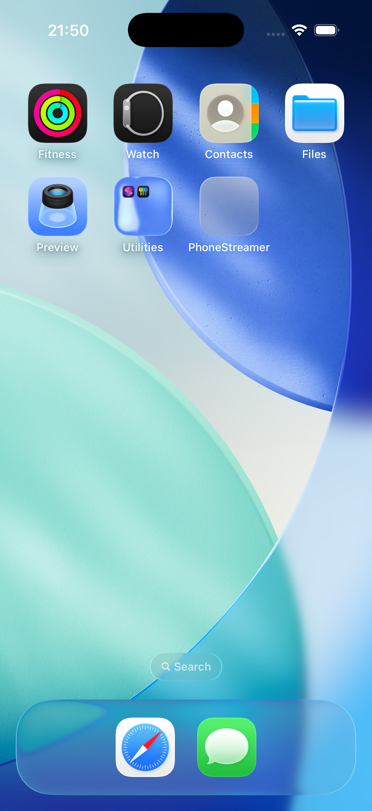
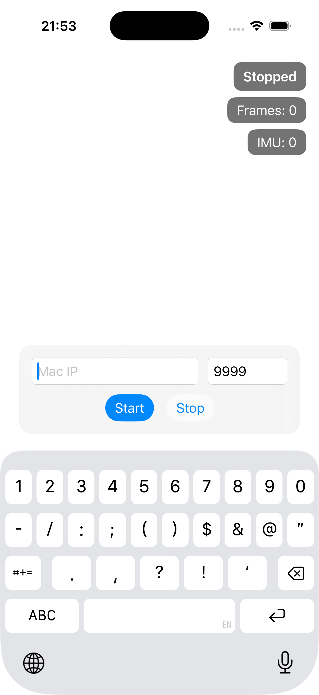

# PhoneStreamer

PhoneStreamer is an iOS app designed to capture sensor data (IMU and RGB frames) from an iPhone and stream it to your laptop.


## Quick start

### 1) Clone the repository

```bash
git clone https://github.com/MoyangLi00/PhoneStreamer.git
```
### 2) Open the project in Xcode
Please make sure you have Xcode installed and that your environment supports a recent version of Swift.

### 3) Build and run the project
##### a. Enable Developer Mode on your iPhone.
##### b. Connect your iPhone to your Mac and select your iPhone as the target device in Xcode.
##### c. Build and run the project.
##### d. Trust the developer profile on your iPhone by following this path: "Settings" -> "VPN & Device Management" -> "Developer App" -> "PhoneStreamer".

### 4) Try to capture some data
a. Find the iOS app `PhoneStreamer` on your iPhone and open it.  


b. Enter the IP address and port of your laptop in the app.  


c. Tap `Start` to begin capturing and streaming data to your laptop.  
d. Tap `Stop` to stop capturing data.